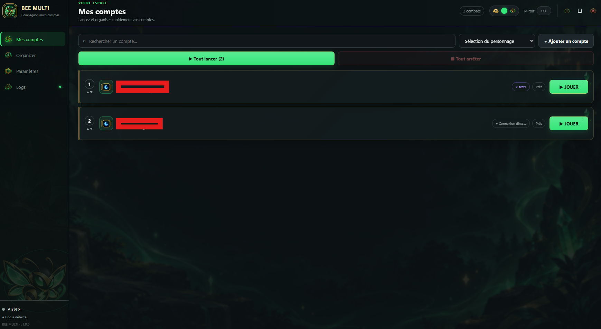
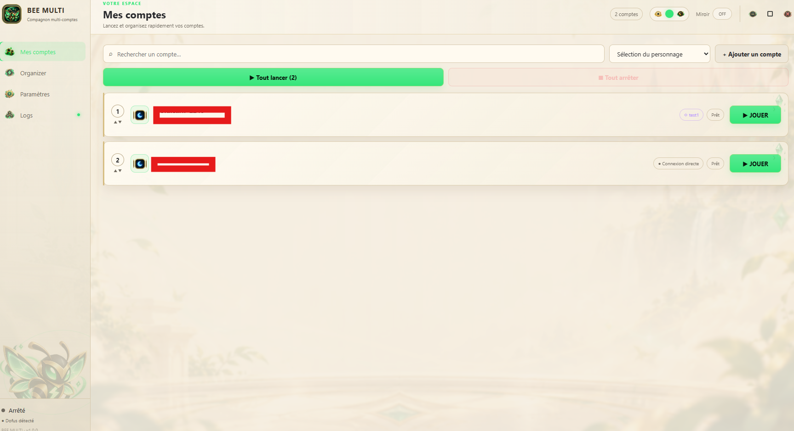
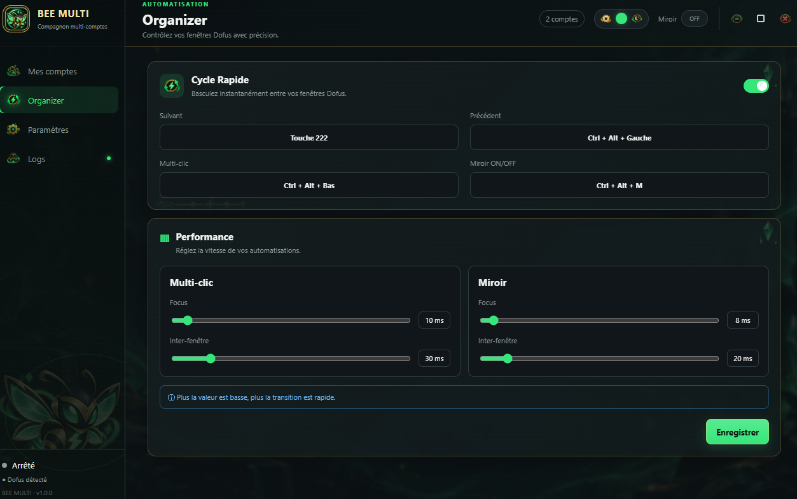
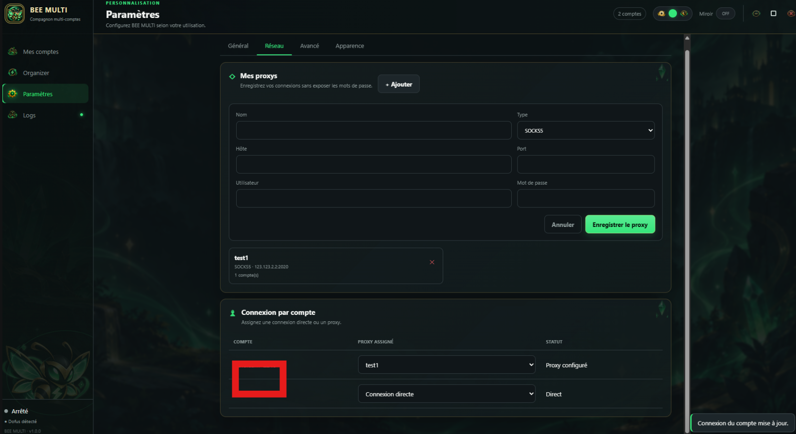
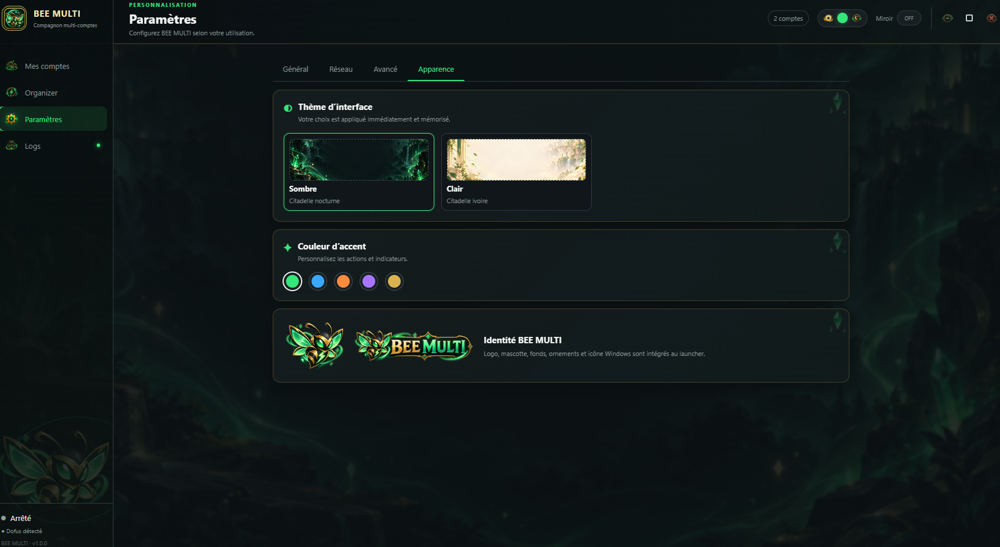
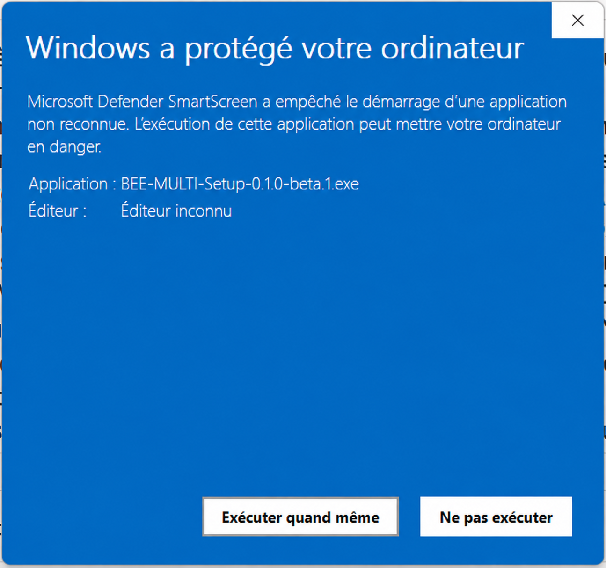

  

  

# BEE MULTI

**Votre compagnon multi-comptes pour Dofus sur Windows.**

[Télécharger la dernière bêta](../../releases/latest) · [Rejoindre le Discord](https://discord.gg/5HmKF5r7MS) · [Signaler un problème](../../issues/new)

BEE MULTI rassemble dans une seule interface les outils essentiels aux joueurs multi-comptes. Lancez vos sessions, organisez vos fenêtres et adaptez votre espace de jeu à votre rythme, sans multiplier les manipulations.

Cette première version publique est proposée en bêta afin de recueillir les retours des joueurs et de faire évoluer l’application avec sa communauté.

## Rejoignez la communauté

Besoin d’aide, envie de partager une suggestion ou de suivre les prochaines nouveautés ? Rejoignez le serveur officiel BEE MULTI :

  <a href="https://discord.gg/5HmKF5r7MS"><strong>Rejoindre le Discord BEE MULTI</strong></a>

## Découvrez BEE MULTI

### Tous vos comptes, prêts en un instant

Retrouvez les comptes détectés depuis Zaap dans un tableau de bord clair. Choisissez l’ordre de lancement, démarrez un compte précis ou lancez toute votre équipe en un clic. Chaque session affiche immédiatement son mode de connexion et son état.

  

### Deux ambiances, une même expérience

Passez librement du thème sombre, profond et immersif, au thème clair, lumineux et apaisant. L’interface conserve la même lisibilité et les mêmes commandes, quelle que soit l’ambiance choisie.

  

### Gardez le rythme avec Organizer

Cycle Rapide permet de passer instantanément d’une fenêtre Dofus à l’autre grâce à vos propres raccourcis. Ajustez finement la réactivité du Multi-clic et du mode Miroir pour obtenir une navigation fluide, adaptée à votre façon de jouer.

  

### Une connexion maîtrisée pour chaque compte

Enregistrez vos proxys puis attribuez simplement une connexion directe ou un proxy distinct à chaque compte. Le statut reste visible en permanence afin de garder une vue nette sur la configuration de votre équipe.

  

### Votre launcher, votre style

Personnalisez BEE MULTI avec un thème clair ou sombre et plusieurs couleurs d’accent. Logo, mascotte, décors et contrôles de fenêtre forment une identité cohérente jusque dans les moindres détails.

  

## Fonctionnalités

- lancement individuel ou groupé des comptes détectés dans Zaap ;
- arrêt individuel ou global des sessions actives ;
- classement personnalisé des comptes ;
- Cycle Rapide avec raccourcis clavier configurables ;
- Multi-clic et Miroir avec délais ajustables ;
- gestion et attribution des proxys par compte ;
- thèmes sombre et clair avec couleurs d’accent ;
- journal d’activité en direct pour suivre le launcher ;
- fenêtre entièrement intégrée avec contrôles personnalisés.

## Installation

1. Ouvrez la page des [Releases officielles](../../releases/latest).
2. Téléchargez la dernière version de `BEE-MULTI-Setup.exe`.
3. Lancez l’installeur et suivez les étapes affichées.
4. Au premier démarrage, vérifiez le chemin de Dofus dans **Paramètres > Général**.

## Autoriser l’installation avec Windows SmartScreen

La bêta n’étant pas encore signée avec un certificat commercial, Windows peut afficher **« Windows a protégé votre ordinateur »** lors du premier lancement. Cet avertissement est attendu pour cette version.

Pour lancer BEE MULTI :

1. Vérifiez que l’installeur provient bien des Releases officielles de `BeeMulti/BEE-MULTI`.
2. Cliquez sur **Informations complémentaires** si ce lien est affiché.
3. Vérifiez que le nom de l’application commence par `BEE-MULTI-Setup`.
4. Cliquez sur **Exécuter quand même**.
5. L’installeur BEE MULTI s’ouvrira normalement.

  

> N’autorisez jamais un fichier BEE MULTI reçu par message privé ou téléchargé depuis un autre site. Utilisez exclusivement les Releases officielles de ce dépôt.

## Prérequis

- Windows 10 ou Windows 11 en 64 bits ;
- Dofus et Zaap installés ;
- au moins un compte déjà connecté dans Zaap.

Node.js et le runtime .NET sont inclus dans l’application : aucune installation supplémentaire n’est nécessaire.

## Bêta-test

La version `0.1 Beta` est destinée aux premiers testeurs. Si vous rencontrez un problème, ouvrez une issue en précisant :

- votre version de Windows ;
- la version de BEE MULTI ;
- les étapes permettant de reproduire le problème ;
- les lignes utiles de la page **Logs**, sans publier d’information sensible.

## Confidentialité

BEE MULTI ne demande pas votre mot de passe Ankama dans son interface. Les réglages de l’application restent sur votre ordinateur.

## Avertissement

BEE MULTI est un projet indépendant et non officiel. Il n’est ni affilié, ni approuvé, ni sponsorisé par Ankama. Dofus, Zaap et les marques associées appartiennent à leurs propriétaires respectifs.

L’utilisateur reste responsable du respect des conditions d’utilisation du jeu et des services associés.

## Licence

Copyright © 2026 BEE MULTI. Tous droits réservés. La redistribution, la modification ou la rétro-ingénierie du logiciel ne sont pas autorisées sans permission écrite.
